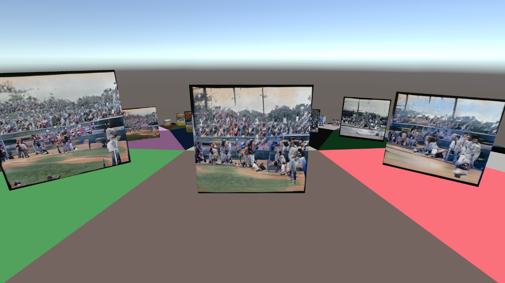

# MercatorUnity
Unity implementation for [Mercator](https://github.com/rl27/Mercator).

Corresponding server for image generation: [MercatorUnityServer](https://github.com/rl27/MercatorUnityServer)

Picture: A hyperbolic world populated by generated images from the sentence "A street scene with a double-decker bus on the side of the road". Model source: https://github.com/drboog/Lafite